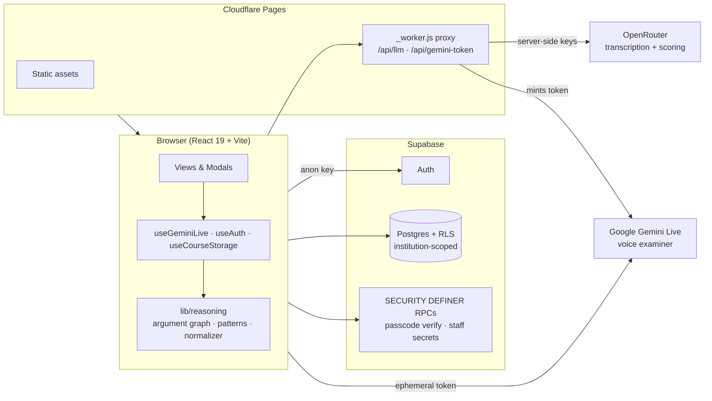

<div align="center">
  
</div>

# SpeakWise

Institution-ready AI oral assessment platform for structured speaking interviews, transcript-based evaluation, instructor review, and deployment across courses and institutions.

**Live:** [app](https://speakwise-oral-exam.pages.dev) · [walkthrough guide](https://speakwise-guide.pages.dev)

[](https://github.com/Educatian/speakwise-oral-exam/actions/workflows/ci.yml)


## At a Glance

| Student experience | Instructor analytics |
| --- | --- |
|  |  |
| Calm pre-interview screen with mic check | Cohort statistics, triage list, CSV/JSON export |
|  |  |
| Institution-scoped course list | Radial argument / concept map with Toulmin colour mode |

🎬 **Narrated video tutorials** (Playwright screencast + ElevenLabs narration, with an on-screen guiding cursor):
[Student tutorial](https://speakwise-guide.pages.dev/videos/student-tutorial.mp4) · [Instructor tutorial](https://speakwise-guide.pages.dev/videos/instructor-tutorial.mp4) — embedded in the [walkthrough guide](https://speakwise-guide.pages.dev).

## Overview

SpeakWise is built for schools, programs, and instructors who need more than a generic AI voice demo. It provides a calmer, assessment-focused environment where:

- students complete guided oral interviews,
- instructors review transcript evidence and override scores when needed,
- institutions organize assessment by workspace, course, and operational policy.

The product combines AI interview delivery, transcript analysis, concept-map visualization, instructor annotations, and institution-level administration in one React application.

## Core Capabilities

- AI-led oral interview flow with turn-based speaking detection and a calm, low-anxiety UI
- transcript capture, evaluation, and rubric-aligned feedback
- **reasoning analytics**: a Toulmin-aligned reasoning rubric, dialogue metrics, and an LLM↔pattern **score-agreement** check with **confidence calibration**
- **human-review triage**: every submission is flagged (or not) for instructor review with explicit reasons, surfaced at the top of the dashboard
- **radial argument / concept map** — concentric by reasoning depth, with semantic edge colours (supports / causal / counter / responds), node size by centrality, weak-structure flags, and a gold ring on concepts cited in the score
- **cohort analytics**: mean / median / SD, small-n caveat, score distribution, and **CSV / JSON export** with analysis/prompt/model version stamps for reproducibility
- instructor review workflow with score validation and override, plus transcript-linked annotations
- course templates for repeatable institution rollout
- **institution-scoped access enforced by Supabase Auth + Row Level Security** (a signed-in user sees only their institution's data)
- admin console for roles, institution coverage, and audit activity

A walkthrough guide (student + instructor) with recorded videos is hosted at **[speakwise-guide.pages.dev](https://speakwise-guide.pages.dev)** (source under [docs/guidebooks](docs/guidebooks)).

## Product Position

SpeakWise is designed as an academic assessment environment, not a consumer voice chatbot.

The app prioritizes:

- calm student experience,
- explainable scoring,
- human review,
- institution deployment readiness,
- and operational trust.

For the guiding principles behind the product, see [PRODUCT_PHILOSOPHY.md](PRODUCT_PHILOSOPHY.md).

## User Experience

### Students

- sign in with app-managed accounts
- select an institution workspace
- enter a course and complete an oral interview
- review score, feedback, reasoning evidence, and concept map outputs

### Instructors

- create institution-scoped courses
- generate or edit AI interview prompts
- save reusable course templates
- review submissions, annotate transcripts, and override scores

### Administrators

- manage roles and access
- monitor institution coverage
- review recent audit activity and operational health

## Tech Stack

- React 19 + TypeScript + Vite
- Supabase — **Auth + Postgres + Row Level Security** + RPCs
- Google Gemini Live for the voice interview; OpenRouter (gpt-4o-audio transcription, Gemini scoring) for analysis
- D3 for the argument/concept map
- Cloudflare Pages hosting

## Architecture



API keys for LLM calls never ship in the client bundle: the Pages worker proxies OpenRouter requests and mints **ephemeral** Gemini Live tokens server-side.

## Quality Gates

- `npm run type-check` — TypeScript
- `npm run lint` — ESLint 9 (flat config)
- `npm run test` — Vitest unit tests for the reasoning/analytics/utils layers
- `npm run build` — Vite production build
- `npm run smoke` — Playwright smoke test against a deployment
- CI runs all of the above on every push/PR ([.github/workflows/ci.yml](.github/workflows/ci.yml))

## Local Development

### Prerequisites

- Node.js 20+

### Environment

Create a local `.env` based on [.env.example](.env.example).

Required values:

- `GEMINI_API_KEY`
- `VITE_SUPABASE_URL`
- `VITE_SUPABASE_ANON_KEY`

### Run

```bash
npm install
npm run dev
```

### Quality Checks

```bash
npm run type-check
npm run build
```

## Deployment

For production setup:

1. Apply [supabase/production_schema.sql](supabase/production_schema.sql) in Supabase SQL Editor.
2. Configure environment variables for Gemini and Supabase.
3. Follow [DEPLOYMENT_CHECKLIST.md](DEPLOYMENT_CHECKLIST.md).

## Current Architecture Notes

- Authentication uses **Supabase Auth**; role and institution live in `user_profiles` (created by a signup trigger, with instructor role gated server-side — never self-claimed).
- **Row Level Security enforces institution isolation** — an anonymous client can read nothing; a signed-in user sees only their own institution's courses, submissions, and history.
- The app supports Supabase-backed persistence with local fallback behavior for selected workflows.
- Institution-level deployment features include templates, annotations, instructor review, and audit logging.
- Migration runbooks: [AUTH_MIGRATION_RUNBOOK.md](AUTH_MIGRATION_RUNBOOK.md), [SECURITY_HARDENING.md](SECURITY_HARDENING.md).

## Repository Structure

- [App.tsx](App.tsx): application shell and route orchestration
- [components/views](components/views): student, instructor, and admin screens
- [components/modals](components/modals): submission review and detailed analysis surfaces
- [hooks](hooks): auth, storage, history, and live interview hooks
- [lib/supabase](lib/supabase): database access and app-managed auth integration
- [supabase](supabase): production SQL schema

## Status

SpeakWise is actively evolving from a strong prototype into a more fully operational institution-ready assessment product. The current codebase already supports the main end-to-end product story:

- institution-aware access
- course creation and template reuse
- live oral interview sessions
- AI scoring with instructor review
- transcript evidence and concept map analysis

## Contact

If you are adapting this repository for a specific institution, start with the deployment checklist and Supabase schema, then align branding, access policy, and course templates to your rollout model.
