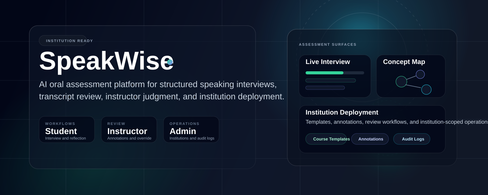

<div align="center">
  
</div>

# SpeakWise

Institution-ready AI oral assessment platform for structured speaking interviews, transcript-based evaluation, instructor review, and deployment across courses and institutions.

## Overview

SpeakWise is built for schools, programs, and instructors who need more than a generic AI voice demo. It provides a calmer, assessment-focused environment where:

- students complete guided oral interviews,
- instructors review transcript evidence and override scores when needed,
- institutions organize assessment by workspace, course, and operational policy.

The product combines AI interview delivery, transcript analysis, concept-map visualization, instructor annotations, and institution-level administration in one React application.

## Core Capabilities

- AI-led oral interview flow with turn-based speaking detection
- transcript capture, evaluation, and rubric-aligned feedback
- interactive argument and concept map with search, export, and timeline playback
- instructor review workflow with score validation and override
- transcript-linked reviewer annotations
- course templates for repeatable institution rollout
- institution-aware course and access structure
- admin console for roles, institution coverage, and audit activity

## Product Position

SpeakWise is designed as an academic assessment environment, not a consumer voice chatbot.

The app prioritizes:

- calm student experience,
- explainable scoring,
- human review,
- institution deployment readiness,
- and operational trust.

For the guiding principles behind the product, see [PRODUCT_PHILOSOPHY.md](C:\Users\jewoo\Desktop\speakwise1.1\speakwise-oral-exam\PRODUCT_PHILOSOPHY.md).

## User Experience

### Students

- sign in with app-managed accounts
- select an institution workspace
- enter a course and complete an oral interview
- review score, feedback, reasoning evidence, and concept map outputs

### Instructors

- create institution-scoped courses
- generate or edit AI interview prompts
- save reusable course templates
- review submissions, annotate transcripts, and override scores

### Administrators

- manage roles and access
- monitor institution coverage
- review recent audit activity and operational health

## Tech Stack

- React 19
- TypeScript
- Vite
- Supabase database and RPCs
- Google Gemini for interview and evaluation workflows

## Local Development

### Prerequisites

- Node.js 20+

### Environment

Create a local `.env` based on [.env.example](C:\Users\jewoo\Desktop\speakwise1.1\speakwise-oral-exam\.env.example).

Required values:

- `GEMINI_API_KEY`
- `VITE_SUPABASE_URL`
- `VITE_SUPABASE_ANON_KEY`

### Run

```bash
npm install
npm run dev
```

### Quality Checks

```bash
npm run type-check
npm run build
```

## Deployment

For production setup:

1. Apply [supabase/production_schema.sql](C:\Users\jewoo\Desktop\speakwise1.1\speakwise-oral-exam\supabase\production_schema.sql) in Supabase SQL Editor.
2. Configure environment variables for Gemini and Supabase.
3. Follow [DEPLOYMENT_CHECKLIST.md](C:\Users\jewoo\Desktop\speakwise1.1\speakwise-oral-exam\DEPLOYMENT_CHECKLIST.md).

## Current Architecture Notes

- Authentication is app-managed and stored against `app_users` in Supabase.
- The app supports Supabase-backed persistence with local fallback behavior for selected workflows.
- Institution-level deployment features include templates, annotations, instructor review, and audit logging.

## Repository Structure

- [App.tsx](C:\Users\jewoo\Desktop\speakwise1.1\speakwise-oral-exam\App.tsx): application shell and route orchestration
- [components/views](C:\Users\jewoo\Desktop\speakwise1.1\speakwise-oral-exam\components\views): student, instructor, and admin screens
- [components/modals](C:\Users\jewoo\Desktop\speakwise1.1\speakwise-oral-exam\components\modals): submission review and detailed analysis surfaces
- [hooks](C:\Users\jewoo\Desktop\speakwise1.1\speakwise-oral-exam\hooks): auth, storage, history, and live interview hooks
- [lib/supabase](C:\Users\jewoo\Desktop\speakwise1.1\speakwise-oral-exam\lib\supabase): database access and app-managed auth integration
- [supabase](C:\Users\jewoo\Desktop\speakwise1.1\speakwise-oral-exam\supabase): production SQL schema

## Status

SpeakWise is actively evolving from a strong prototype into a more fully operational institution-ready assessment product. The current codebase already supports the main end-to-end product story:

- institution-aware access
- course creation and template reuse
- live oral interview sessions
- AI scoring with instructor review
- transcript evidence and concept map analysis

## Contact

If you are adapting this repository for a specific institution, start with the deployment checklist and Supabase schema, then align branding, access policy, and course templates to your rollout model.
