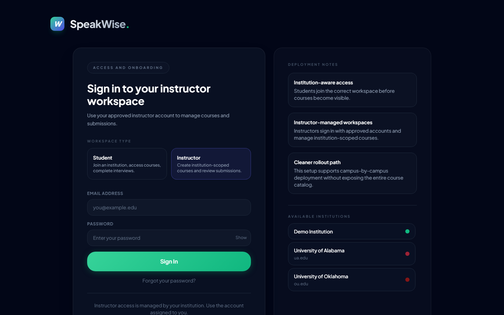
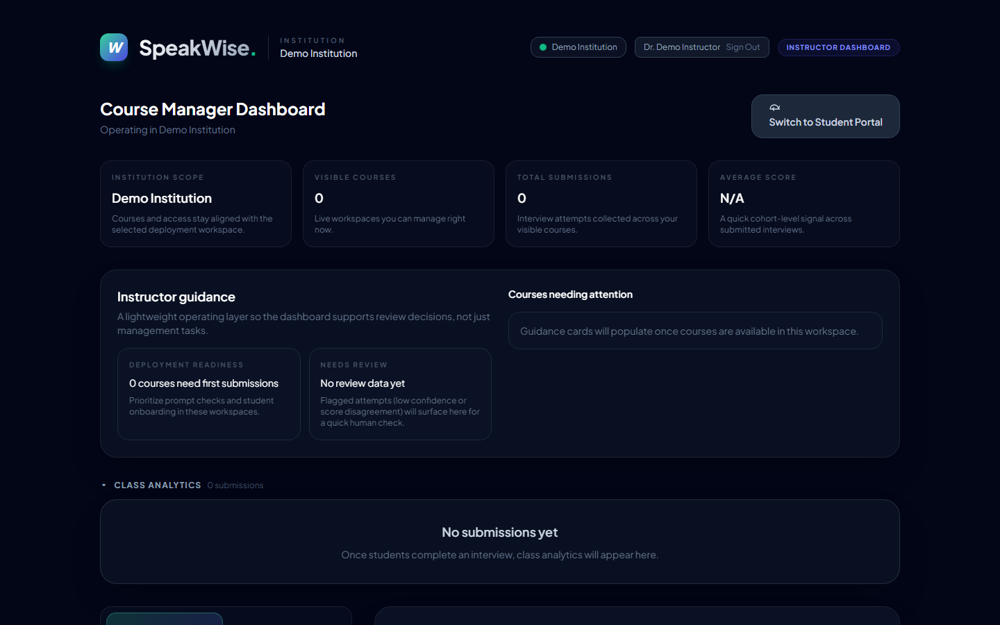
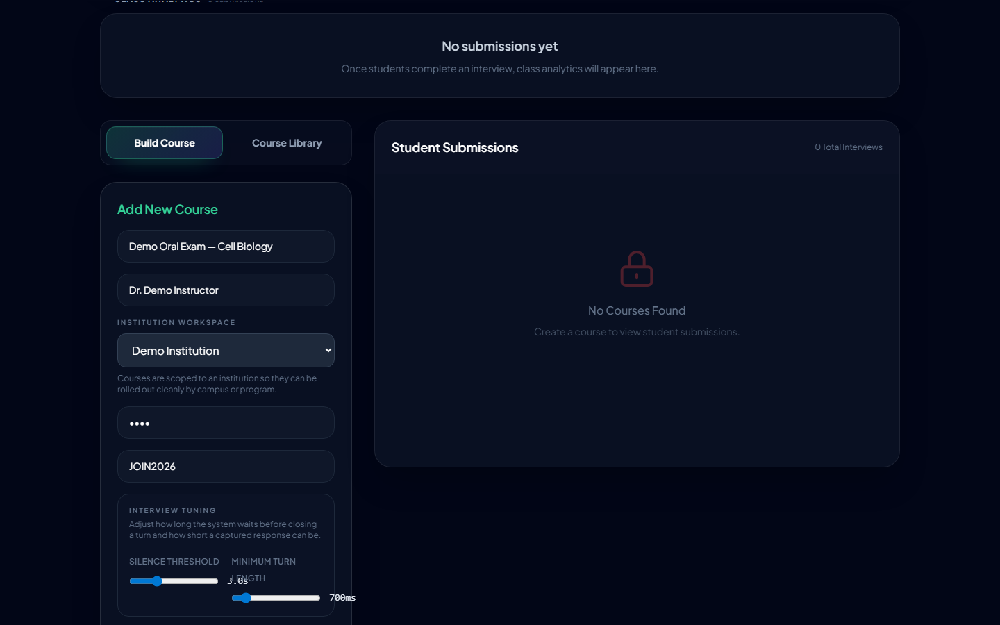
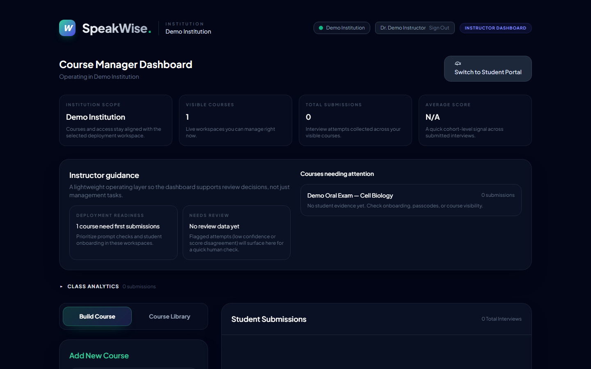
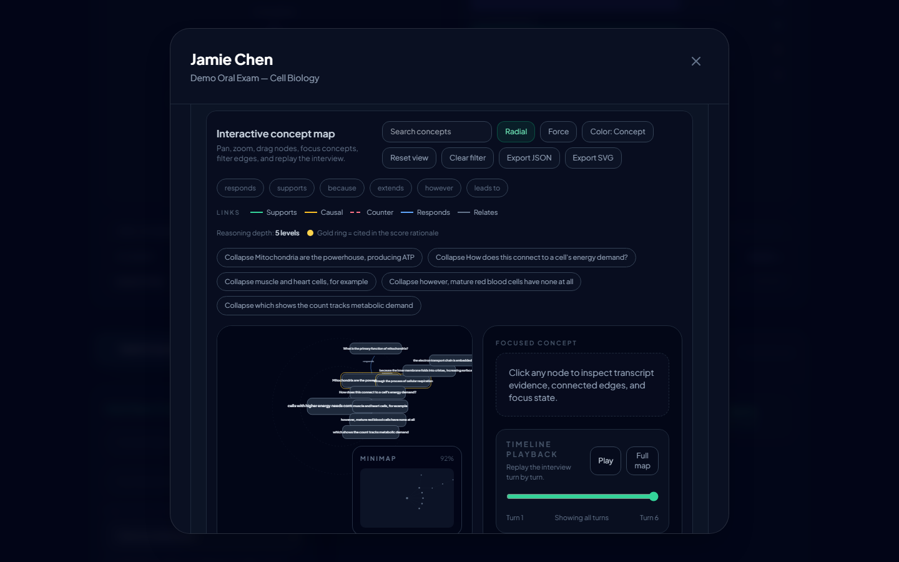
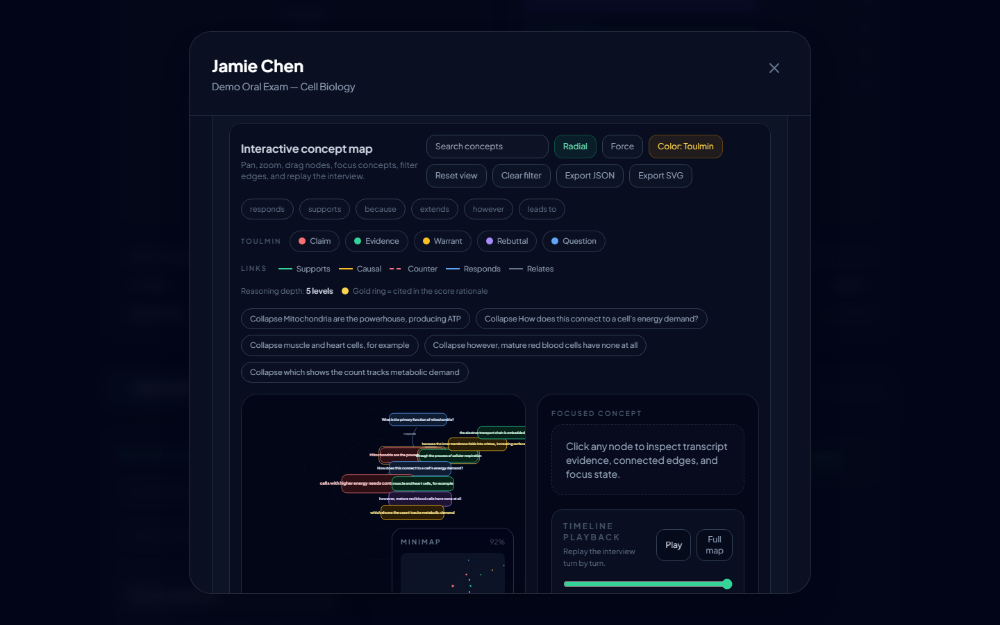

# SpeakWise — Instructor Walkthrough Guide

A step-by-step guide for instructors: create a test, manage participating students, and read analytics.
Live app: **https://speakwise-oral-exam.pages.dev**

🎬 **Narrated video tutorial:** [`videos/instructor-tutorial.mp4`](videos/instructor-tutorial.mp4) — voice-guided, with an on-screen cursor (ElevenLabs narration)
🎬 **Silent walkthrough:** [`videos/instructor-journey.webm`](videos/instructor-journey.webm)
*(recorded live: sign-in → dashboard → create course → analytics, with a demo instructor account.)*

---

## 1. Open SpeakWise and choose "Instructor"


## 2. Sign in with your provisioned instructor account

Instructors don't self-register — your email is added to the institution's instructor registry (or you're the admin), and you **sign in**. Your role is granted server-side, so a student can never self-claim instructor access.



---

## 3. Dashboard overview — your operating layer

After sign-in you land on the **Course Manager Dashboard**:
- Top stat cards: institution scope, visible courses, total submissions, average score.
- An **Instructor guidance** panel with a **"Needs review"** card that shows, in amber, how many submissions the system flagged for a human look (low model confidence, large LLM↔pattern score disagreement, or thin evidence) — your actionable queue, right at the top.
- A **Courses needing attention** list (no submissions yet / low average).



## 4. Create a test (course)

In the left panel **Add New Course**:
- Name the course and set the student **entry code (passcode)** + an instructor **PIN**.
- Write or **AI-generate** the interview prompt; optionally import questions from a `.docx`.
- Tune interview settings (silence threshold, minimum turn length).
- Save reusable **course templates** for repeatable rollout.

Created courses are scoped to your institution automatically.



## 5. Manage participating students + read analytics

Open **Class Analytics** (expanded by default):
- **Cohort metrics** with **mean, median, and standard deviation** for score and reasoning, plus a small-cohort caveat when n < 5.
- **Score distribution** histogram + **score-over-time** sparkline.
- **Class rubric profile** radar + reasoning-dimension bars.
- A **"Flagged for review"** triage list (click through to the submission).
- **Export CSV / JSON** of the whole cohort — including rubric, reasoning, confidence, score-agreement, Toulmin completeness, and **analysis/prompt/model version stamps** for reproducibility.
- A per-student table with sortable columns and **review-status dots** (amber = needs review, green = reviewed).



## 6. Review a submission (human-in-the-loop)

Open any submission for the full evidence view:
- **Rubric breakdown** radar with per-dimension evidence quotes.
- **Reasoning quality** bars + **Toulmin completeness** strip (Claim/Data/Warrant/Backing/Qualifier/Rebuttal, with "to strengthen" guidance).
- **Argument / concept map** — now a true **radial** layout (concentric rings by reasoning depth, children clustered near their parent), with assessment-aligned cues:
  - edges coloured by reasoning move (**Supports / Causal / Counter / Responds / Relates**),
  - node size by **centrality** (how much the student leaned on a concept),
  - **weak-structure flags** ("No Evidence/Warrant/Rebuttal" + dashed-amber unsupported nodes),
  - a **gold ring** on concepts cited in the score rationale (map → grade traceability),
  - radial / force layout toggle, Toulmin colour mode, timeline replay, and JSON/SVG export.
- **Transcript-linked annotations** and a **score override + notes** workflow — your judgment is recorded prominently on the student's result.

---

🎬 **Concept-map walkthrough video:** [`videos/concept-map.webm`](videos/concept-map.webm) — the radial argument map (Radial/Force layouts, Toulmin colour mode, semantic edge legend, timeline replay) on a real seeded submission.





## Regenerating this walkthrough

```bash
INSTRUCTOR_EMAIL='demo.instructor@speakwise-test.com' INSTRUCTOR_PASSWORD='Demo-Instructor-2026!' \
FLOW=instructor node playwright/walkthrough.mjs
```

The instructor account's email must be in the `instructors` registry (or be the admin) so the signup trigger grants the instructor role. Run `FLOW=student` (or `both`) for the student journey.
