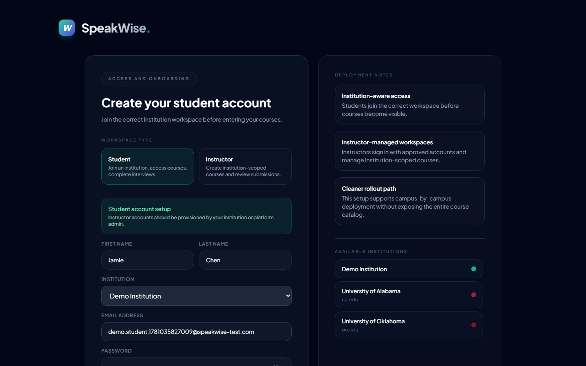
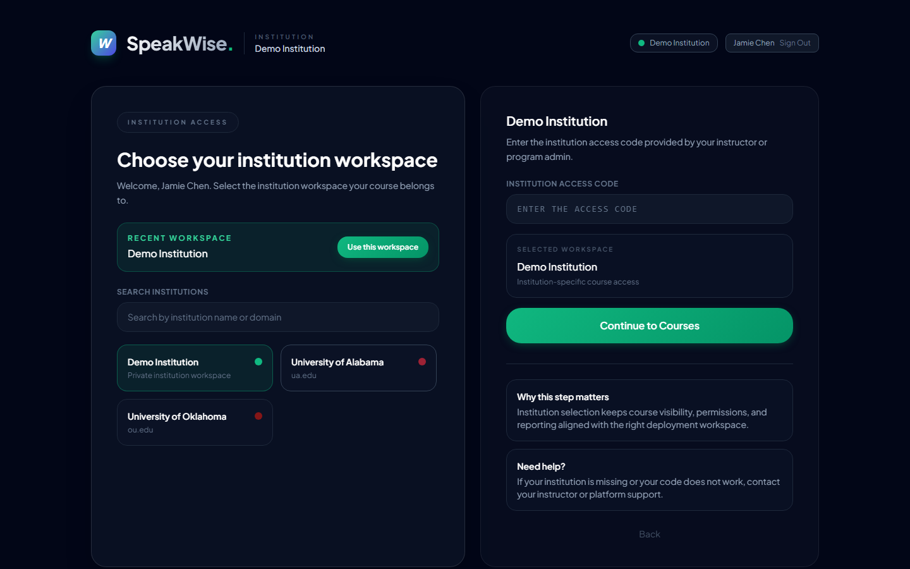
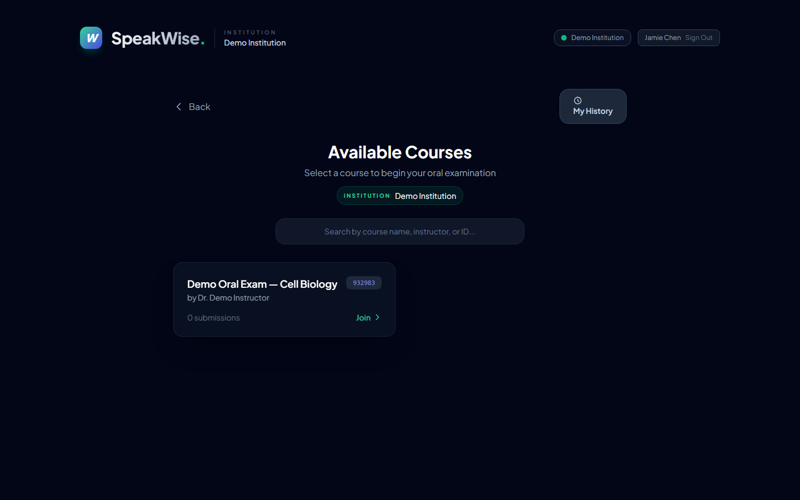
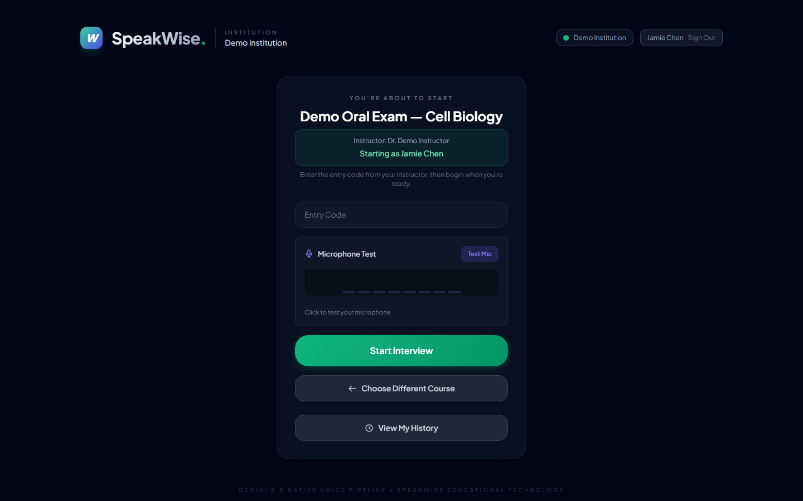

# SpeakWise — Student Walkthrough Guide

A step-by-step guide for students taking an oral interview on SpeakWise.
Live app: **https://speakwise-oral-exam.pages.dev**

🎬 **Video walkthrough:** [`videos/student-journey.webm`](videos/student-journey.webm)
*(recorded with Playwright against the live deployment; screenshots below are frames from the same run)*

---

## 1. Open SpeakWise and choose "Student"

You land on a calm entry screen. Pick the **Student** path to access your institution, courses, and interview history.

## 2. Sign in, or create your account

Returning students sign in. New students choose **"Create one now"**. Instructor accounts are provisioned by your institution — students self-serve here.

## 3. Create your student account

Enter your name, pick your **institution**, and set an email + password (min 6 characters). Your institution choice is what keeps your courses scoped correctly.

## 4. Confirm your institution workspace

Enter the **institution access code** your instructor or program admin gave you (e.g. the demo workspace uses `DEMO`), then **Continue to Courses**. This step keeps course visibility and reporting aligned to the right campus.

## 5. Pick your course

Your available courses appear (only those in your institution). Select the one your instructor assigned and choose **Join**.

> If the list is empty, your instructor hasn't published a course in your workspace yet — check the course name/code with them.

## 6. Start the oral interview

A calm, single pre-interview screen: **"You're about to start *{course}*"** with your name already filled in (**Starting as …**). Enter the **entry code** from your instructor, run the **microphone test**, then **Start Interview**.

During the interview the screen stays deliberately calm:
- Phase cards (**Connect → Listen → Respond → Review**) show where you are.
- A live level meter reflects your real microphone input.
- If you pause, supportive prompts appear ("take your time") — silence is fine.
- A **"Done speaking"** button lets you end a turn when ready.

> The live voice interview requires the deployment to have its AI keys configured. On a keyless preview build the interview step won't run, but every other screen works.

## 7. Review your results and reflect

After the interview you get a tabbed results view:
- **Overview** — your score with a plain-language band, an evaluation summary, "what worked well", and "next priorities".
- **Reasoning** — your reasoning-quality breakdown and an argument/concept map.
- **Peers** — anonymous comparison with classmates' ideas.
- **Transcript** — the full turn-by-turn conversation with tagged argument nodes.

If your attempt was flagged for instructor review, a gentle **"This result is provisional"** note appears — there's nothing you need to do; your instructor may adjust the score.

---

*Regenerate this walkthrough's media: `node playwright/walkthrough.mjs` (FLOW=student).*
