# SpeakWise — 강사 가이드북 (Instructor Guide)

> **대상**: 본인 과목에서 SpeakWise로 구술 인터뷰를 운영하고, 학생 응답을 채점·분석하는 강사 및 연구자.
> **버전 기준**: 2026-04-24 시점 `master` — Class Analytics 섹션, Submission 분석 패널, Concept Map Toulmin 모드 포함.

---

## 1. 시작하기 — 랜딩과 로그인

SpeakWise의 진입 페이지는 학생 포털과 강사 워크스페이스를 하나의 화면에서 분기합니다.

**순서**
1. **Instructor Workspace** 버튼을 클릭합니다.
2. 통합 인증 화면이 열립니다. 이메일과 비밀번호를 입력하고 **Sign in**을 누르세요.

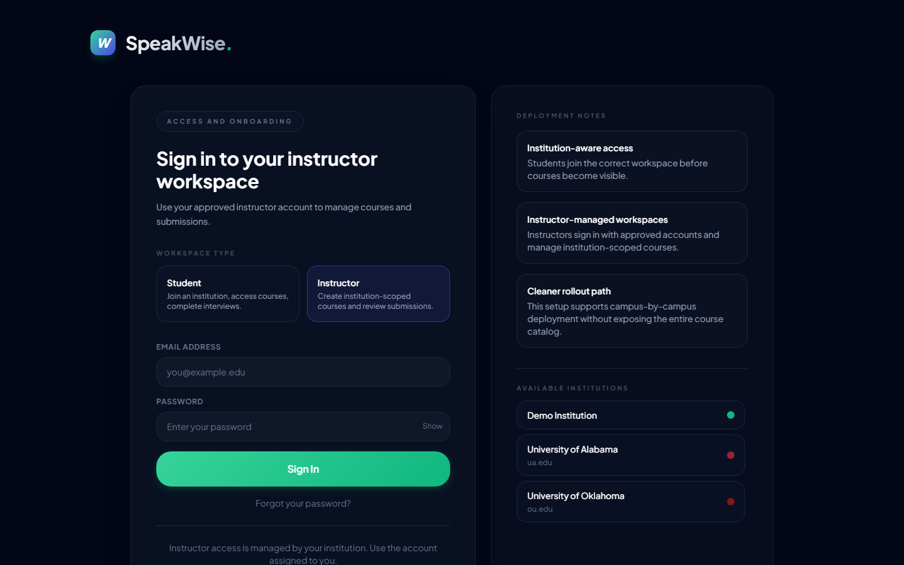

> **계정이 처음이라면**: 왼쪽 상단의 모드 토글을 통해 회원가입 폼으로 전환해 이메일, 역할, 소속 기관을 함께 등록하세요. ADMIN_EMAIL(시스템 상수)에 등록된 이메일로 가입하면 관리자 권한이 자동 부여되어 **모든 기관의 모든 코스를 볼 수 있습니다**.

로그인 직후, 시스템은 Supabase에서 본인 소속 기관의 코스·제출을 로드합니다. 완료 전에는 "Loading from Supabase…" 플레이스홀더가 잠시 보입니다.

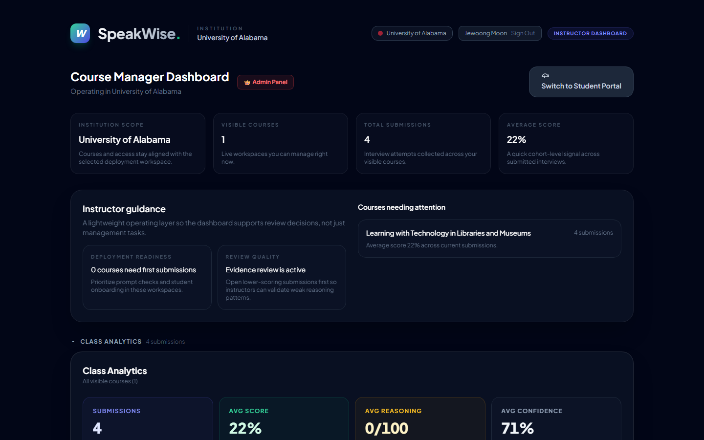

---

## 2. 대시보드 구조

로그인이 끝나면 **Course Manager Dashboard**로 자동 이동합니다. 한 화면에 세 개의 큰 구역이 있습니다:

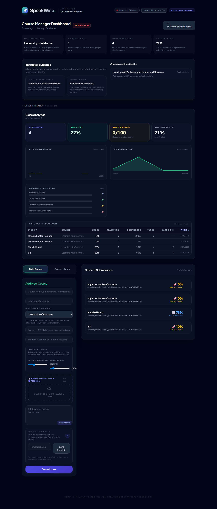

| 구역 | 역할 |
|---|---|
| **상단 헤더** | 기관 선택 상태, 현재 로그인 이메일, 관리자 패널 진입 버튼 (admin 전용). |
| **가운데 — 요약 카드 + 가이드** | 기관 범위, 가시 코스 수, 누적 제출 수, 평균 점수 / Instructor guidance 카드. |
| **Class Analytics 섹션** | 클래스 수준의 메트릭·차트·per-student 테이블. **접을 수 있습니다** (▾ 버튼). |
| **하단 — 코스 빌더 + 제출 목록** | 왼쪽은 "Build Course / Course Library" 탭. 오른쪽은 최근 제출 목록. |

> **관리자 vs 일반 강사**: 관리자는 모든 기관·코스·제출을 봅니다. 일반 강사는 `ownerEmail`이 본인 이메일과 일치하는 코스만 보입니다. 코스에 접근이 안 보인다면 해당 코스의 owner_email을 확인하세요.

---

## 3. Class Analytics — 클래스 수준 분석

Class Analytics 섹션은 **기본적으로 열려 있습니다.** 닫고 싶으면 제목 왼쪽의 ▾ 삼각형을 눌러 토글합니다. 열어두면 5단계의 시각 레이어가 순서대로 보입니다.

### 3.1 Top-line Metric Cards

네 개의 카드가 나란히 표시됩니다 (왼쪽부터):

| 카드 | 의미 | 해석 힌트 |
|---|---|---|
| **Submissions** | 가시 코스 전체의 총 제출 수 | 0이면 먼저 학생 초대 / passcode 배포를 확인 |
| **Avg Score** | AI 점수 평균 (0–100) | 낮으면 rubric이 엄격한지, 학생이 준비가 덜 됐는지 판단 필요 |
| **Avg Reasoning** | `reasoningRubric.overallReasoningScore` 평균 | Toulmin 요소 커버리지 기반 — AI 점수와 독립적으로 해석 |
| **Avg Confidence** | AI가 자기 평가를 얼마나 확신하는지 (0–100%) | 낮으면 transcript가 너무 짧거나 모호했다는 신호 |

### 3.2 Score Distribution & Time Series

- **Score Distribution** — 0–100을 10개 bin으로 나눈 히스토그램. 분포가 한쪽으로 쏠려 있으면 rubric 조정을 고려하세요.
- **Score over time** — 오래된 제출 → 최신 제출 순서의 스파크라인. 시간이 갈수록 점수가 오르면 학생들이 포맷에 익숙해진 신호.

### 3.3 Reasoning Dimensions Bar Chart

네 축 — Explicit Justification, Causal Explanation, Counter-Argument Handling, Abstraction/Generalization — 각각 0–5 평균으로 표시. 낮은 축이 전체 개선 타겟입니다.

### 3.4 Per-Student Breakdown Table

- 컬럼: Student / Course / Score / Reasoning / Confidence / Turns / Barge-ins / When
- **헤더 클릭으로 정렬** — 점수 오름차순으로 정렬하면 하위 10%가 바로 보입니다.
- **행 클릭으로 Submission Detail 모달 열기** — 다음 섹션에서 설명.

> **연구용 팁**: 이 테이블 자체를 copy-paste해서 Excel / R로 붙여 넣을 수 있습니다. 추후 별도 CSV export 기능이 들어올 예정 (Track R).

---

## 4. Submission 상세 워크스루

per-student 테이블에서 행을 클릭하거나, 오른쪽 최근 제출 목록의 카드를 클릭하면 **Submission Detail 모달**이 열립니다. 이 모달은 세로 스크롤이 긴 편이라 섹션별로 설명합니다.

### 4.1 상단 — 점수 + AI Feedback + Confidence

- 학생 이름, 코스, 제출 시각
- 마스터리 레벨 (이모지 + %)
- **AI Feedback** — Gemini가 생성한 3–5문장의 종합 피드백
- **AI Confidence** — AI가 이 평가를 얼마나 확신하는지. Rationale 한 줄도 함께 보입니다. 0.3 미만이면 강사 직접 재평가를 권장.

### 4.2 Rubric Breakdown Radar

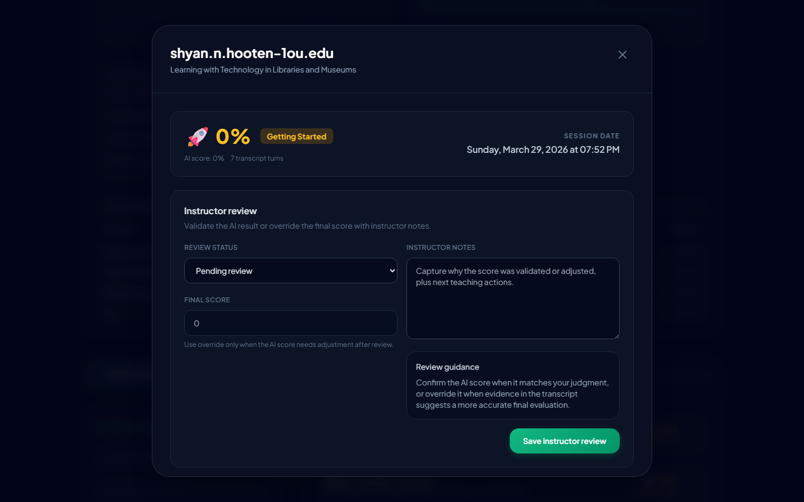

- 왼쪽에 4축 radar: Conceptual / Clarity / Critical / Engagement (각 0–25점)
- 오른쪽에 각 차원의 점수 + **증거 인용 펼침** (▸ 클릭)
- 증거 인용은 AI가 transcript에서 직접 뽑은 구절입니다. 강사는 이걸 보고 AI 판단의 타당성을 즉시 검증할 수 있습니다.

### 4.3 Reasoning Quality + Session Timing

**Reasoning Quality 블록**
- 4개 가로 막대: Explicit Justification / Causal Explanation / Counter-Argument Handling / Abstraction (각 0–5)
- 오른쪽 상단에 Overall Reasoning Score (0–100)
- 아래에 raw 카운트: "Justifications: 3, Causal patterns: 2, …" — 언어학적 패턴 탐지 결과.

**Session Timing 블록**
- 4개 metric card: Turns / Avg Response / Max Delay / Turn-Taking
- 응답 지연 시계열 sparkline — 턴을 거치며 학생이 빨라지는지/느려지는지
- Dialogue metrics: Initiatives, Rephrasing, Avg follow-up chars, Latency σ

> **Barge-in 이벤트 패널**은 바로 그 아래에 표시되는데, 해당 제출이 interruption 이벤트가 있을 때만 렌더됩니다. interpretation 뱃지가 **Confidence (초록)** / **Hasty (노랑)** / **Correction (파랑)** / **Unclassified (회색)** 중 하나로 표시됩니다.

### 4.4 Speech capture archive (upstream)

`rawTranscriptTurns` + `failedTranscriptions`를 보여주는 블록입니다. 너무 짧거나 실패한 턴을 디버깅할 때 유용합니다. 연구 재현성 관점에서 중요.

### 4.5 Integrated Analysis Workspace — Concept Map

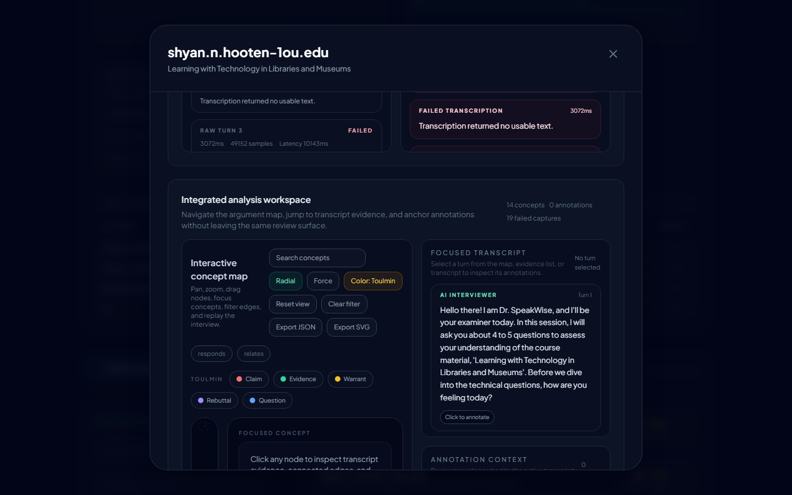

학생 응답의 개념 구조를 시각화한 영역. 다음 섹션에서 상세히 설명합니다.

---

## 5. Concept Map 완전 활용법

Submission 상세 중앙부에 있는 **Integrated analysis workspace**는 강사가 가장 많이 보게 될 도구입니다. 왼쪽에 노드-엣지 그래프, 오른쪽에 transcript + annotation 영역이 나란히 붙어 있습니다.

### 5.1 기본 조작

| 제스처 | 결과 |
|---|---|
| 배경 드래그 | 전체 캔버스를 pan |
| 휠 스크롤 | 포인터 위치 기준으로 zoom |
| 노드 드래그 | 해당 노드만 수동 배치 (저장됨) |
| 노드 클릭 | 오른쪽 사이드바에 해당 개념의 상세 + transcript 참조 |
| 엣지 클릭 | 해당 관계 유형으로 필터 적용 |

### 5.2 레이아웃 모드 — Radial vs Force

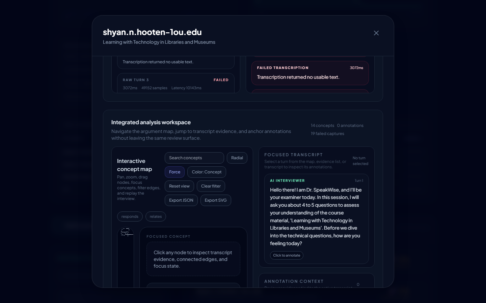

- **Radial** (기본) — 루트 노드를 중심으로 레벨별 동심원 배치. 구조가 선명.
- **Force** — d3-force 기반 시뮬레이션. 관계가 복잡하거나 레벨이 불명확한 경우 더 자연스러운 클러스터를 드러냅니다.

### 5.3 컬러 모드 — Concept vs Toulmin ⭐

**Color: Concept / Toulmin** 버튼으로 토글.

- **Concept 모드** (기본) — THEORY(인디고) / PRINCIPLE(앰버) / DOMAIN(바이올렛) / TOOL(시안) / EXAMPLE(틸) 다섯 계층으로 색 구분. 도메인 지식의 종류를 보여줍니다.
- **Toulmin 모드** — 각 노드의 담론 역할(claim/evidence/warrant/rebuttal/question)로 색 구분:
    - 🔴 **Claim** (rose)
    - 🟢 **Evidence** (emerald)
    - 🟡 **Warrant** (amber) — 논리적 교량
    - 🟣 **Rebuttal** (violet) — 반대·대응
    - 🔵 **Question** (blue) — 인터뷰어의 질문

### 5.4 Toulmin 필터 칩

Toulmin 모드에서만 나타나는 칩 행. 각 칩에 해당 색 점이 찍혀 있어 **범례가 곧 필터**입니다.

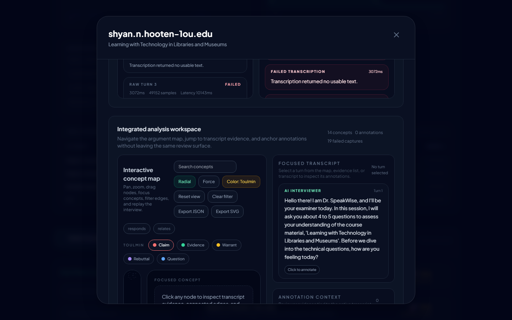

- **Claim 칩 클릭** → Claim 역할의 노드만 남고 나머지는 사라짐
- 다시 클릭하면 해제
- "Clear filter" 버튼을 누르면 Toulmin 필터와 관계 필터가 모두 풀림

**연구 활용 시나리오**
- *"이 학생은 Claim은 많은데 Evidence가 적은가?"* — Claim만 켜고 센 뒤, Evidence만 켜고 비교
- *"Warrant density를 cohort 간 비교"* — 여러 Submission 상세를 비교할 때 Warrant만 켠 상태 스크린샷을 나란히

### 5.5 Replay — Timeline Playback

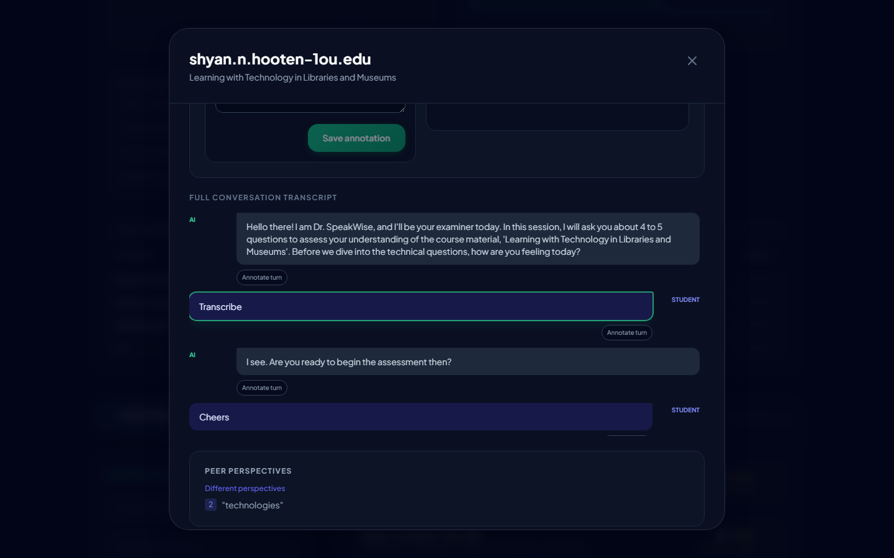

오른쪽 사이드바의 Timeline playback 카드:

- **Play / Pause** — 턴 단위로 자동 전진 (1.1초 간격 기본)
- **Full map** — 전체 턴을 한 번에 보여줌 (활성 턴 상태 해제)
- 슬라이더 — 특정 턴으로 드래그 이동
- **턴이 진행될수록 그래프가 자라납니다** — 새로 등장하는 노드는 520ms 동안 scale + fade 애니메이션으로 드러남. 현재 언급되는 노드는 녹색 pulse 효과.

**키보드 단축키** (어떤 인풋 필드에도 포커스가 없을 때):

| 키 | 동작 |
|---|---|
| `←` | 이전 턴 |
| `→` | 다음 턴 |
| `Home` | 첫 턴 |
| `End` | 마지막 턴 |
| `Space` | 재생/정지 토글 (빈 상태에서는 첫 턴부터 자동 재생) |

### 5.6 검색 + 관계 필터 + 클러스터 접기

상단 툴바의 **Search concepts** 입력은 노드의 content·type·conceptType을 대소문자 무관하게 검색합니다. 매칭된 노드만 남고 나머지는 흐려집니다.

**관계 필터** 칩(Defines / Requires / Exemplifies / Enables / Located in)은 엣지 라벨 기준으로 해당 관계만 남깁니다. Toulmin 필터와 독립적이며 중첩 적용됩니다.

**Cluster collapse** — 레벨 1 노드(허브)에 해당하는 모든 하위 노드를 한 번에 접어서 숨깁니다. 허브가 많아 그래프가 복잡할 때 유용.

---

## 6. Instructor Review — 점수 검증·오버라이드

Submission 상세 하단에는 **instructor review** 영역이 있습니다 (upstream 기능).

- **Validated** — AI 점수를 그대로 확정
- **Override** — 본인 판단으로 점수 수정 (0–100, 자유 입력)
- **Notes** — 내부 코멘트

이 상태 정보는 `submission_reviews` 테이블에 저장되며 나중에 inter-rater reliability 분석의 원천 데이터가 됩니다.

---

## 7. Annotation — 특정 턴에 메모 남기기

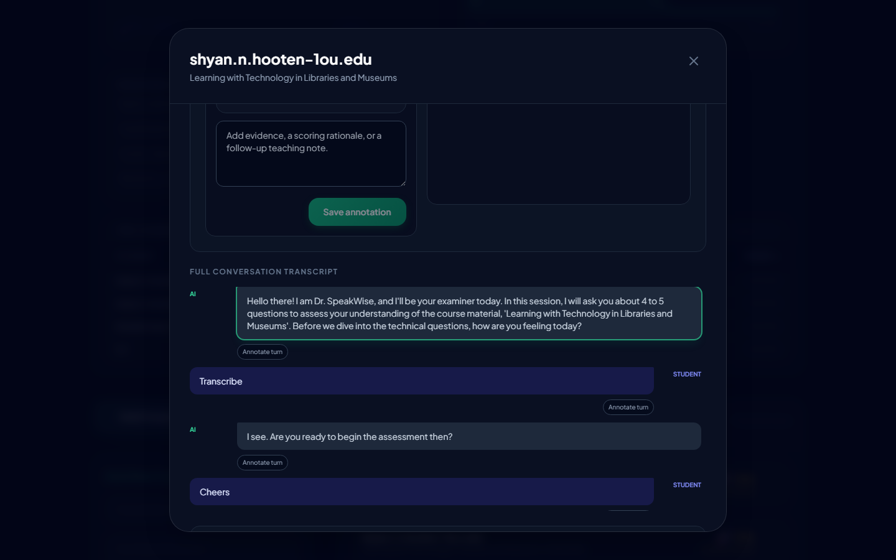

transcript 각 턴 옆의 **"Click to annotate"** 클릭 → 카테고리 선택 (strength / concern / evidence / follow_up) + 노트 작성 → Save.

카테고리 별 색:
- 🟢 **Strength** — 잘한 부분
- 🔴 **Concern** — 우려 지점
- 🔵 **Evidence** — 특정 주장의 근거로 인용 가능
- 🟡 **Follow up** — 후속 점검 필요

annotation은 `submission_annotations` 테이블에 저장되어 **다른 강사와 실시간 동기화**됩니다 (realtime subscription).

---

## 8. 코스 만들기 (왼쪽 패널)

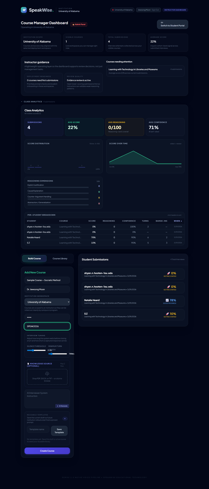

대시보드 하단 왼쪽의 **Build Course** 탭에서 신규 코스를 생성합니다.

필수 항목:
- **Course Name**
- **Instructor Name**
- **Instructor PIN (4 digits)** — 학생 제출을 볼 때 본인 확인용
- **Student Passcode** — 학생이 코스에 입장할 때 입력
- **Institution** — 드롭다운에서 선택
- **Silence Threshold / Turn Duration** — 음성 턴 분리 감도 (기본 3000ms / 700ms)
- **Knowledge Source (선택)** — PDF/DOCX/TXT 최대 2개 업로드 → Gemini로 질문 자동 추출 가능

**System Prompt (Interviewer 인스트럭션)** — 하단에 텍스트박스로 직접 작성하거나 ✨ *Generate AI prompt* 버튼으로 Gemini에게 맡길 수 있습니다. 좋은 프롬프트가 인터뷰 질 전체를 좌우합니다.

**Course Library** 탭에서는 이전에 저장한 템플릿을 재사용할 수 있습니다.

---

## 9. 기존 코스 관리

대시보드 오른쪽 제출 목록 위에 각 코스 카드가 있습니다.

- **View** — 코스 상세 (프롬프트 편집, 제출 목록)
- **Delete** — 코스 삭제 (cascade로 제출도 함께 삭제)

두 동작 모두 **Instructor PIN 검증**이 걸립니다 (admin 또는 본인이 생성한 코스는 생략 가능).

코스 상세 안에서 **System Prompt를 수정**하면 이후 진행되는 인터뷰에 즉시 반영됩니다. 이미 제출된 submission은 영향 없음.

---

## 10. Admin Panel (관리자 전용)

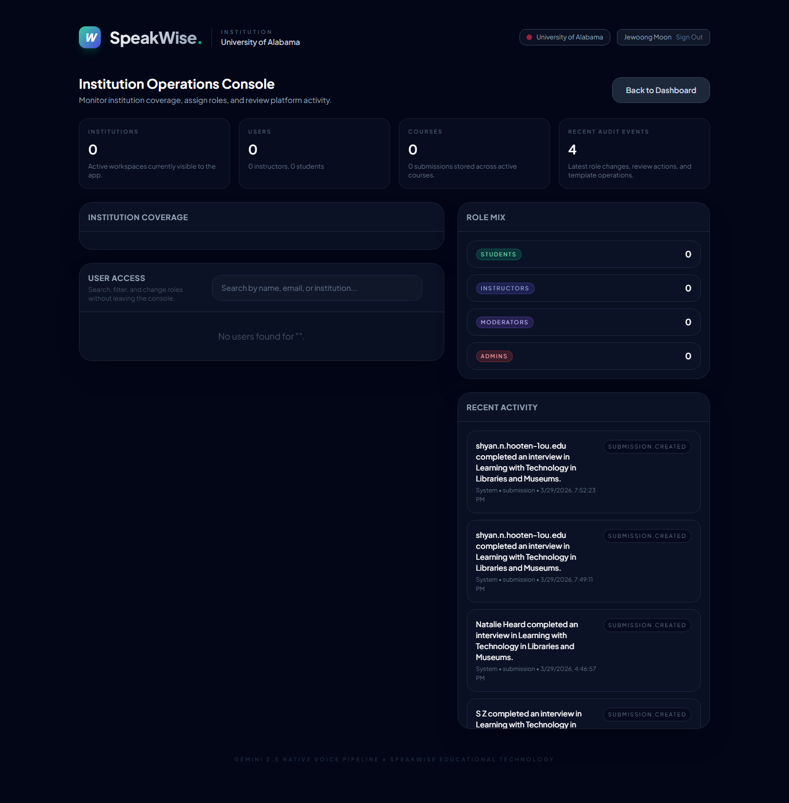

`jewoong.moon@gmail.com`(ADMIN_EMAIL)로 로그인한 경우 헤더 우상단에 **👑 Admin Panel** 버튼이 노출됩니다. 여기서:

- Institution Operations Console — 기관 coverage, 역할 mix
- User Access 검색 / 역할 변경
- Recent Activity — P2 마이그레이션으로 설치된 DB 트리거가 submission.created 이벤트를 자동 기록한 실시간 스트림
- 기관 관리 (생성/수정/access code 변경)

> **현재 한계**: app-managed auth 하에서 `is_admin_role()` 헬퍼가 Supabase-Auth JWT를 전제로 동작하기 때문에 일부 카운트(Institutions, Users, Courses)가 0으로 보입니다. P3 세션 토큰 도입 후 이 디스플레이 갭이 닫힙니다.

---

## 11. 내보내기

- **Export JSON** (Concept map 툴바) — 현재 그래프 + 뷰포트 + 접힌 클러스터 상태 전부 JSON
- **Export SVG** (Concept map 툴바) — 포스터/논문 figure용 벡터 내보내기
- **Print report** (Submission detail 하단) — 브라우저 인쇄 → PDF 저장. 인쇄 스타일시트가 적용되어 글래스 패널이 흰 종이용으로 변환됨

> **아직 없는 것 (Track R 예정)**: 전체 클래스 CSV / 연구용 tidy long format JSON. 논문 작성 시 raw 데이터가 필요하면 우선 Supabase SQL Editor로 직접 추출해 주세요.

---

## 12. 알면 좋은 것 — 성능·운영

- **Gemini 키 관리**: Vercel 환경변수 `GEMINI_API_KEY`가 Build 환경(Production/Preview/Development 모두)에 체크되어 있어야 student 인터뷰의 음성 파이프라인이 동작합니다. 키 만료 시 AI Studio에서 재발급 후 Vercel 환경변수 갱신 → redeploy.
- **`app_users.email` 보호**: 이제 anon 키로는 이메일이 보이지 않습니다. 사용자 목록은 `list_app_users_for_admin` RPC 경유.
- **`audit_logs`**: 제출 생성 시 DB 트리거가 자동 기록. 클라이언트가 보낸 domain event(코스 삭제, 역할 변경 등)는 `log_audit_event` RPC로 통합됨.
- **세션 토큰 인증 (P3)**: 아직 미도입. 현재는 publishable key가 있으면 RPC를 누구나 호출 가능한 상태. IRB 제출 전에 도입 권장.

---

## 부록 — 트러블슈팅

| 증상 | 원인 가능성 | 조치 |
|---|---|---|
| 대시보드가 끝없이 "Loading from Supabase…" | Supabase 프로젝트 일시 정지 (free tier 7일 비활성) | Supabase 대시보드에서 "Restore project" 클릭, 1–2분 대기 |
| 로그인 성공했는데 대시보드가 비어 있음 | 본인 이메일이 admin이 아니고 `course.owner_email`에도 안 맞음 | 해당 코스 owner_email을 본인 이메일로 변경하거나, 관리자에게 요청 |
| Concept Map이 비어 있고 "No argument data" 표시 | transcript가 너무 짧거나 패턴이 거의 감지 안 됨 | 인터뷰어 프롬프트를 보강해 학생이 claim·evidence를 더 명시적으로 말하도록 유도 |
| rubric radar / reasoning 바가 안 보임 | 해당 submission에 `rubricBreakdown` / `reasoningRubric` 필드가 비어 있음 | R1 rubric_breakdown 백필 스크립트 (`playwright/.backfill-rubric.mjs` 동일 서버) 실행 |
| Toulmin 칩이 안 보임 | Concept 모드일 때는 숨겨져 있음 | **Color: Concept** 버튼을 눌러 **Color: Toulmin**으로 전환 |

---

*이 문서는 `playwright/capture.mjs`로 자동 생성된 스크린샷과 함께 제공됩니다. 기능이 변경될 때마다 캡처를 다시 실행하면 스크린샷이 갱신됩니다.*
