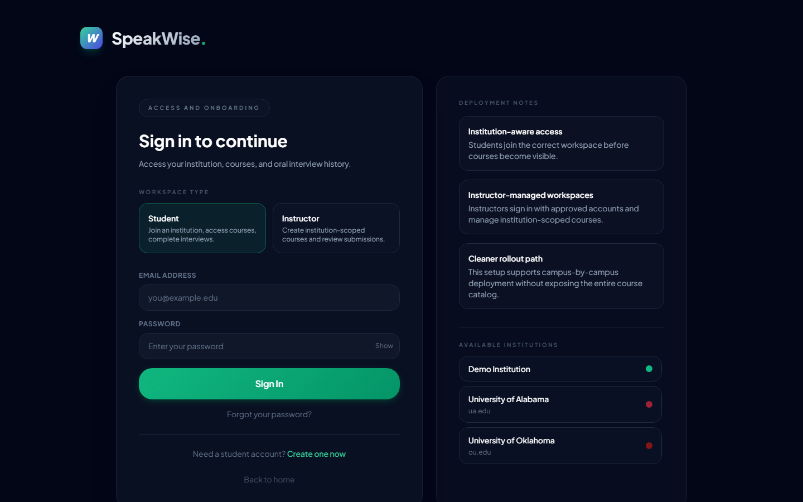
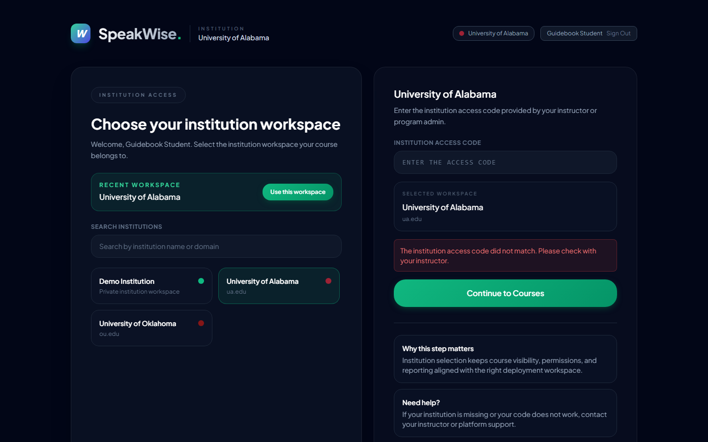
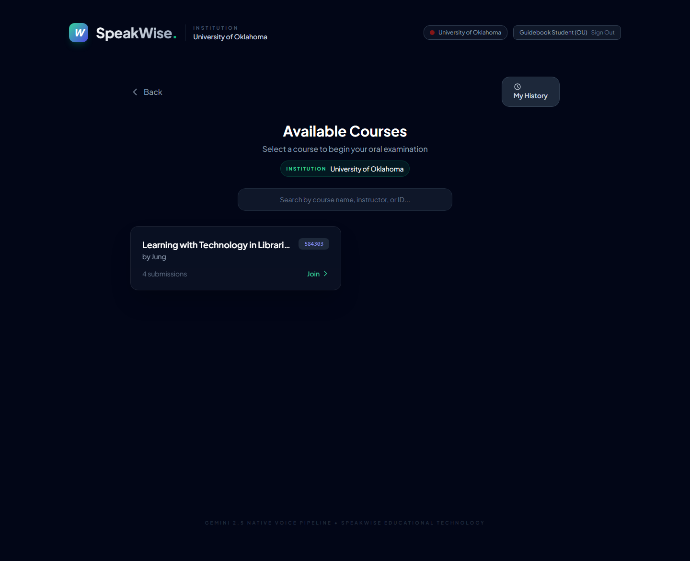
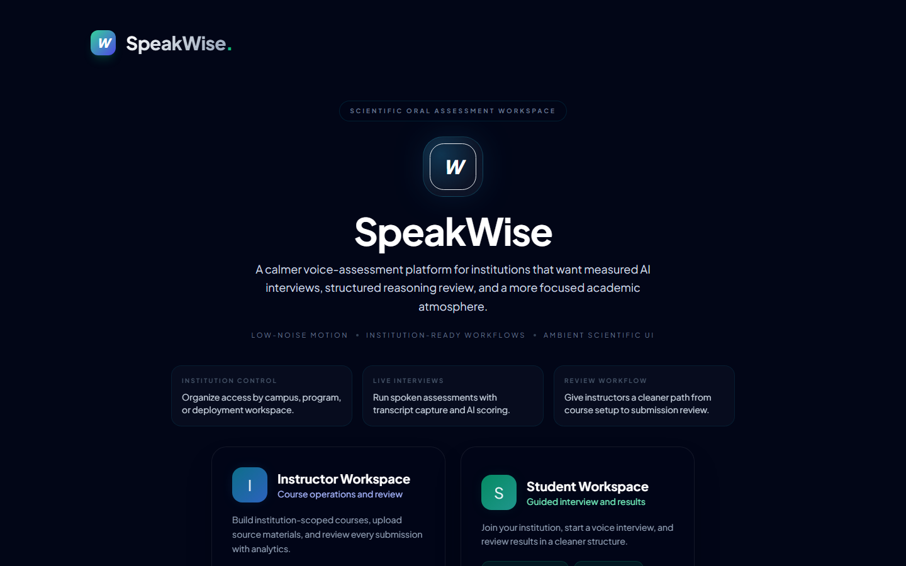

# SpeakWise — 학생 가이드북 (Student Guide)

> **대상**: SpeakWise로 구술 인터뷰를 보는 학생.
> **준비물**: 마이크가 동작하는 노트북/데스크톱, 조용한 공간 5–10분, 강사로부터 받은 **기관 access code**와 **코스 passcode**.
>
> 🎬 **나레이션 비디오 튜토리얼** (약 2분): [student-tutorial.mp4](https://speakwise-guide.pages.dev/videos/student-tutorial.mp4) — 음성 안내와 커서 표시가 포함된 학생 여정 전체 영상 (영어 나레이션).

---

## 1. SpeakWise가 뭐고 나는 뭘 하게 되나요

SpeakWise는 음성으로 진행되는 **AI 구술 인터뷰 플랫폼**입니다. 교수님이 낸 주제에 대해, AI 인터뷰어 "Dr. SpeakWise"가 여러분에게 4–5개의 질문을 합니다. 여러분은 **말로** 답하고, 시스템이 답변을 자동으로 텍스트로 기록합니다. 끝나면 점수와 개인 피드백이 즉시 나옵니다.

시험처럼 엄격한 단방향이 아니라, **대화처럼** 진행됩니다. 막히면 AI가 힌트를 단계적으로 줄 수도 있어요. 답을 모른다고 당황할 필요 없습니다.

---

## 2. 로그인까지

### 2.1 랜딩 페이지

링크 (예: `https://speakwise-oral-exam.vercel.app/`)를 여시면 두 개의 큰 버튼이 보입니다.

- **Student Workspace** — 여러분이 눌러야 할 버튼입니다.
- Instructor Workspace — 교수·조교용. 누르지 마세요.

### 2.2 계정 만들기 또는 로그인

처음이시라면 계정을 먼저 만듭니다 (회원가입 폼으로 전환).

**회원가입 시 입력사항**:
- 이메일 (본인이 자주 쓰는 학교/개인 이메일)
- 비밀번호 (기억 가능한 것으로)
- 이름
- **역할: Student** 선택
- **소속 기관**: 드롭다운에서 본인이 속한 대학을 선택 (예: University of Alabama)

가입이 끝나면 바로 로그인되어 있는 상태가 됩니다.

> **이미 계정이 있다면** 그냥 이메일/비밀번호로 Sign in. 비밀번호를 잊었다면 강사에게 문의하세요 (현재 자동 비밀번호 재설정은 지원되지 않습니다).

---

## 3. 기관 접속 코드 입력

로그인 후, 처음이라면 **기관 접속 코드 입력** 화면이 나옵니다.

- 왼쪽에 기관 목록이 보입니다. 본인 학교를 클릭.
- 오른쪽에 "ENTER THE ACCESS CODE" 박스가 나타납니다.
- **강사로부터 받은 access code**를 대문자 그대로 입력하세요 (예: `ROLL2025`).
- **Continue to Courses** 클릭.

> **코드를 모르는 경우**: 수업 담당 교수 또는 조교에게 물어보세요. SpeakWise는 기관 범위 안에서만 코스를 공개하므로, 코드 없이 들어갈 수 없습니다.

한 번 입력하면 같은 기기/브라우저에서는 기억되어 다음 번부터 자동 진입합니다.

---

## 4. 코스 찾기

기관에 입장하면 해당 기관이 운영하는 **코스 목록**이 보입니다.

- 각 코스 카드에 이름, 담당 강사, 제출 수가 표시됩니다.
- 본인이 참여할 코스를 **클릭**하세요.

> **목록이 비어 있으면**: 본인이 맞는 기관 access code로 들어왔는지, 그리고 강사가 해당 기관에 코스를 등록했는지 확인하세요.

---

## 5. 코스 입장 — Passcode 확인 + 마이크 테스트

코스를 클릭하면 **Join Interview** 화면이 열립니다.

여기에서:
1. **Your Full Name** — 본인 이름 입력 (결과 리포트에 사용됩니다)
2. **Entry Code** — 강사로부터 받은 **코스 passcode** 입력 (기관 코드와는 다릅니다)
3. **마이크 테스트** — "Test Microphone" 버튼 클릭해서 녹음이 되는지 확인

> **마이크 안 잡히면**:
> - 브라우저 주소창 왼쪽 자물쇠 아이콘 → 마이크 권한 "허용"
> - 시스템 환경설정 → 개인 정보 보호 및 보안 → 마이크 → 브라우저 체크
> - 다른 탭이 마이크를 점유하고 있지 않은지 확인 (Zoom, Teams 등 종료)

테스트가 끝나면 **Start Interview** 버튼 활성화.

---

## 6. 인터뷰 진행 요령

### 6.1 시작 순간

**Start Interview** 누르면 AI 인터뷰어가 먼저 말을 겁니다:
> "Hello there! I am Dr. SpeakWise, and I'll be your examiner today…"

자기 소개 후 아이스브레이커 질문 하나 → 본 질문들 (4–5개) → 마무리.

### 6.2 답변하는 법

- **자연스럽게 말하듯** — 완전한 문장 아니어도 괜찮음
- **한두 문장이 아니라 충분히 풀어서 설명** — 평균 30초–1분 정도가 적당
- **구체적 예시를 섞기** — "For example, …"로 시작하는 문장 하나가 점수를 크게 올립니다
- **"왜 그런가요"에 준비된 답** — AI가 follow-up을 자주 합니다 ("Could you explain why?")
- **다 말했으면 3초 정도 침묵** — 시스템이 "턴 종료"를 자동 인식합니다

### 6.3 모를 때 — Scaffolding Hint

답을 잘 모르겠거나 막히면, AI는 자동으로 **3단계 힌트**를 줍니다:

1. **Level 1 — 개념 힌트**: "What is the main characteristic of X?" (답은 안 알려줌)
2. **Level 2 — 예시 힌트**: "Consider a situation where… What happens?"
3. **Level 3 — 쪼갠 질문**: 원 질문을 더 작은 조각으로 나눔

Level 3까지 가도 모르면 AI가 "That's okay, let's move on"으로 넘어갑니다. **모른다고 패널티는 아닙니다** — 시도 자체가 데이터에 기록되므로, 포기하지 말고 말을 계속하는 게 이득입니다.

### 6.4 AI가 말하는 중 끼어들어도 되나

**괜찮습니다.** AI가 말하는 도중 여러분이 말하기 시작하면 "barge-in" 이벤트로 기록됩니다. 이는 자기 확신이 있을 때 자연스러운 반응이라 해석되어 **오히려 engagement 점수에 긍정적으로 작용**합니다. 단, AI 질문을 끝까지 듣지 않고 자르면 문맥을 놓칠 수 있으니 중요한 질문에는 끝까지 듣기를 권장합니다.

### 6.5 언어

**한국어로 해도 괜찮고, 영어로 해도 괜찮습니다.** AI가 여러분의 언어를 따라갑니다. 섞어 써도 따라옵니다.

### 6.6 인터뷰 끝내기

보통 4–5개 질문이 끝나면 AI가 closing message와 함께 자동으로 인터뷰를 종료합니다. 직접 끝내고 싶으면 화면의 **End Interview** 버튼.

종료 후 자동으로:
1. 전체 transcript가 Gemini로 전송되어 평가됩니다 (약 10–20초)
2. 점수 + 피드백 + rubric 분석이 계산됩니다
3. 결과 화면으로 이동

---

## 7. 결과 보기

결과 화면에서 여러분이 보게 될 것:

| 섹션 | 내용 |
|---|---|
| **Score** | 0–100점 + 마스터리 레벨 (이모지) |
| **AI Feedback** | 3–5문장의 종합 피드백 — 잘한 점, 개선할 점, 추천 |
| **Rubric 4축** (Conceptual / Communication / Critical Thinking / Engagement) | 각 0–25점 + AI가 인용한 근거 구절 |
| **Reasoning Quality** | Explicit justification, Causal explanation, Counter-argument handling, Abstraction — 언어학적으로 감지된 reasoning 패턴 |
| **Concept Map** | 내 발언에서 추출된 개념 네트워크. 노드를 클릭하면 해당 transcript 구절이 강조됩니다 |
| **Transcript** | AI와 내가 주고받은 전체 대화 기록 |

### 7.1 내 응답을 "다시 재생"하는 법

Concept Map의 **Timeline playback** 버튼을 누르면, 내 답변이 전개될 때 개념 노드가 하나씩 등장하는 모습을 재생할 수 있습니다. 어느 지점에서 주장을 폈고, 어디에서 근거가 부족했는지 시각적으로 확인 가능합니다.

키보드:
- `←` / `→` — 한 턴씩 뒤로/앞으로
- `Space` — 재생/정지
- `Home` / `End` — 처음/끝

### 7.2 결과 저장하기

- **Print report** 버튼 → 브라우저 인쇄 → PDF로 저장. 나중에 포트폴리오나 성찰 일지에 붙일 수 있습니다.
- 또는 브라우저에서 해당 페이지 URL을 북마크 — History 탭에서 언제든 다시 열람 가능.

---

## 8. My History — 이전 인터뷰 보기

같은 코스에 여러 번 응시했거나 다른 코스에도 참여했다면, 사이드 메뉴의 **View My History**에서 과거 기록을 볼 수 있습니다. 시간 순으로 정렬되어 있습니다.

> **여러 번 응시 가능 여부**는 강사 정책에 따라 다릅니다. 재응시 허용이면 그때그때 새로운 submission으로 기록됩니다.

---

## 9. 흔한 걱정들

### "AI가 나를 오해하면 어떻게 하나요?"

음성 인식은 대체로 정확하지만 완벽하지 않습니다. 녹취록을 결과에서 확인할 수 있고, 오해가 심했다고 느끼면 **강사에게 알리세요** — 강사는 AI 점수를 override할 수 있습니다.

### "마이크가 중간에 끊기면?"

현재 네트워크가 끊기면 세션이 종료됩니다 (이 부분은 개선 예정 — R3). 가능하면 **유선 인터넷이나 안정적인 Wi-Fi** 환경에서 보세요. 중단됐을 때는 강사에게 즉시 알리고 재응시 요청.

### "왜 AI 점수가 낮게 나왔나요?"

대체로 다음 중 하나입니다:
1. **답변이 너무 짧았다** — 10초 미만의 답변은 rubric 평가가 거의 안 됩니다.
2. **예시·근거가 부족했다** — "Because…", "For example…" 류의 근거 연결어를 쓰지 않으면 Causal Explanation / Explicit Justification 점수가 낮아집니다.
3. **AI의 follow-up에 짧게 "yes" / "no"로만 답했다** — Engagement가 크게 떨어집니다.
4. **주제와 먼 이야기** — Conceptual Understanding이 떨어집니다.

### "실수로 질문을 넘겨버렸는데"

재시작은 불가하지만, 다음 턴에서 "Wait, earlier I meant to say…"로 정정하면 AI가 문맥을 잡아서 다시 다룰 수 있습니다. 정정 시도는 **Counter-Argument Handling** 점수에 긍정적.

---

## 10. 연구 참여 고지 (해당되는 경우)

본 과목이 연구(예: IRB 승인된 SRL 연구)의 일부라면 강사로부터 별도의 **동의서(consent form)**를 받게 됩니다. 동의 없이 개인 식별 정보가 연구 데이터로 사용되지 않습니다. 질문은 언제든 강사/연구자에게 직접 문의하세요.

---

*이 가이드는 `playwright/capture.mjs` 스크립트로 자동 캡처된 스크린샷과 함께 유지됩니다.*
